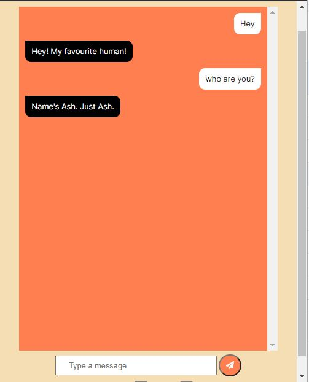
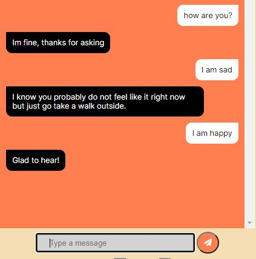
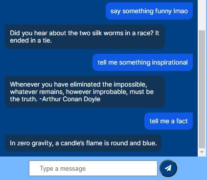
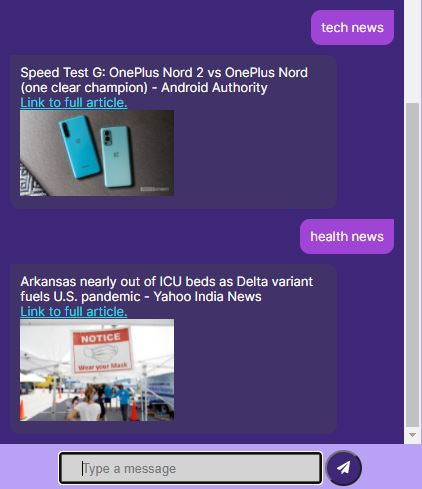

# ASH
A simple chat bot.<br>


### Interact



### Get the latest news


### API's used
<a href="https://github.com/KegenGuyll/DadJokes_API">Dad jokes</a><br>
<a href="https://github.com/sameerkumar18/useless-facts-api">Useless fact</a><br>
<a href="https://github.com/DukeNgn/Dog-facts-API">Dog fact</a><br>
<a href="https://catfact.ninja/">Cat fact</a><br>
<a href="https://documenter.getpostman.com/view/5578104/RWgqUxxh">Cute cat pics</a><br>
<a href="https://dog.ceo/dog-api/">Cute dog pics</a><br>
<a href="https://github.com/lukePeavey/quotable">Quote</a><br>
<a href="https://github.com/SauravKanchan/NewsAPI">News</a><br>

### Setting up
```
pip install -r requirements.txt
```